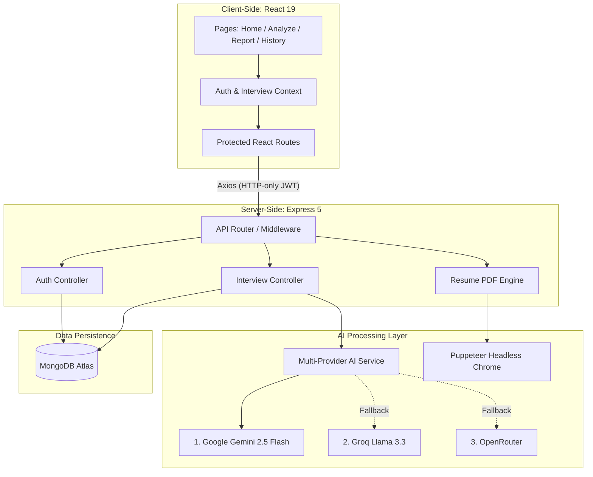

<div align="center">
  

  <h1>✦ JobGenie — AI-Powered Interview Prep & Resume Builder ✦</h1>

  <p>
    <em>Upload your resume. Paste a job description. Let the AI genie craft your winning strategy.</em>
  </p>

  <a href="https://jobgenie-interview-ai.vercel.app" target="_blank">
    
  </a>

  <br />
  <br />

  <div>
    
    
    
    
    
    
    
    
  </div>
</div>

---

## 📋 Table of Contents

- [🚀 What is JobGenie?](#-what-is-jobgenie)
- [✨ Features](#-features)
- [🛠️ Tech Stack](#️-tech-stack)
- [🏗️ Architecture](#-architecture)
- [📸 Screenshots](#-screenshots)
- [🚀 Getting Started](#-getting-started)
- [📡 API Reference](#-api-reference)
- [📁 Project Structure](#-project-structure)
- [🔑 Key Design Decisions](#-key-design-decisions)
- [🤝 Contributing](#-contributing)
- [📜 License](#-license)

---

## 🚀 What is JobGenie?

**JobGenie** is a premium, full-stack AI platform designed to help job seekers **ace their interviews** and **build ATS-optimized resumes**. By simply uploading your current resume and pasting a target job description, JobGenie's multi-model AI engine instantly generates:

- 🎯 **Match Score** — How well you fit the role (0–100%).
- 💡 **Technical Interview Questions** — With expert intentions & comprehensive model answers.
- 🗣️ **Behavioral Interview Questions** — STAR-method answers uniquely tailored to your past experience.
- 📉 **Skill Gap Analysis** — Identifies missing skills with severity ratings and recommendations.
- 🗺️ **Preparation Roadmap** — A dynamic, day-by-day study plan with actionable tasks.
- 📄 **ATS-Optimized Resume PDF** — A beautifully typeset, editorial-grade A4 resume generated on-the-fly.

---

## ✨ Features

### 🧠 Multi-Model AI Engine
JobGenie guarantees high availability through an **intelligent fallback chain** across three distinct AI providers:
1. **Google Gemini 2.5 Flash** (Primary) → Lightning-fast, high-quality structured output.
2. **Groq Llama 3.3 70B** (Fallback) → Ultra-fast inference leveraging state-of-the-art open-source models.
3. **OpenRouter** (Safety Net) → Access to Gemini 2.0 Flash Free tier and other models.
*If one provider is down or rate-limited, JobGenie seamlessly switches to the next — resulting in **zero downtime**.*

### 📊 Intelligent Interview Reports
Every generated report provides a holistic review:
| Section | Details |
|---------|---------|
| **Match Score** | AI-calculated compatibility percentage with visual color-coded indicators. |
| **Technical Questions** | 5+ real-world scenario questions with expert-level model answers. |
| **Behavioral Questions** | 5+ STAR-method questions tailored precisely to your background. |
| **Skill Gaps** | Identified gaps graded with `low` / `medium` / `high` severity to prioritize learning. |
| **Preparation Plan** | A structured 7+ day roadmap with specific tasks & resources. |

### 📄 AI-Generated Resume PDF
- **Refined Editorial Design** — Built using Playfair Display + Source Serif typography.
- **ATS-Safe HTML** — Semantic tags only, zero table-based layouts to ensure parsability.
- **Full A4 Coverage** — The AI intelligently expands sections to fill the page naturally.
- **Human-Sounding Copy** — Prompt-engineered to avoid generic "AI" phrasing.
- **Rendered via Puppeteer** — Delivers a pixel-perfect PDF output, generated server-side.

### 🔐 Robust Authentication System
- **Email/Password** — Secure registration utilizing bcrypt hashing.
- **Google OAuth** — Seamless one-click sign-in via Firebase Authentication.
- **JWT Cookies** — HTTP-only, secure, SameSite cookies for robust session management.
- **Token Blacklisting** — Secure server-side token invalidation upon logout.
- **Protected Routes** — Enforced both on the frontend (React Router guards) and backend (Express middleware).

### 🎨 Premium UI/UX & Design System
JobGenie employs a **premium dark-mode design system** highlighted by striking gold accents (`#D4A017`):
- **Deep Navy Glassmorphism** — Sleek, modern card surfaces (`rgba(255,255,255,0.03)`).
- **Cinzel Typography** — Elegant display font used for headings and brand elements.
- **SCSS Modules** — Scoped, maintainable, zero-conflict styling architecture.
- **Micro-Animations & Toasts** — Smooth transitions, hover glows (`0 0 20px rgba(212,160,23,0.3)`), and contextual user feedback.

---

## 🛠️ Tech Stack

### Frontend
| Technology | Purpose |
|------------|---------|
| **React 19** | UI library with the latest concurrent rendering features. |
| **Vite 8** | Next-gen build tool ensuring instant HMR and optimized builds. |
| **React Router 7** | Client-side routing with complex protected route configurations. |
| **SCSS Modules** | Scoped, component-level CSS architecture. |
| **Axios** | HTTP client configured with request/response interceptors. |
| **Zustand / Context**| State management for Auth & Interview data flows. |

### Backend
| Technology | Purpose |
|------------|---------|
| **Express 5** | High-performance web framework with native async error handling. |
| **Mongoose 9** | MongoDB ODM with strict schema validation. |
| **Google GenAI SDK** | Integration with Gemini 2.5 Flash for core AI capabilities. |
| **Puppeteer** | Headless Chrome instance utilized for perfect PDF rendering. |
| **Firebase Admin** | Server-side validation of Google OAuth tokens. |
| **pdf-parse & multer** | File upload handling and PDF text extraction. |

---

## 🏗️ Architecture



---


## 🚀 Getting Started

### Prerequisites
- **Node.js** (v18.x or higher)
- **MongoDB** (Local instance or MongoDB Atlas)
- **Google Gemini API Key** ([Get one for free](https://aistudio.google.com/app/apikey))
- **Firebase Project** (For Google OAuth authentication)
- *(Optional)* **Groq / OpenRouter API Keys** (For AI fallbacks)

### 1️⃣ Clone the Repository
```bash
git clone https://github.com/jaypatel-tech116/JobGenie-An_Interview_AI.git
cd JobGenie
```

### 2️⃣ Backend Setup
Navigate to the Backend directory and install dependencies:
```bash
cd Backend
npm install
```

Create a `.env` file in the `Backend/` directory:
```env
# Server
PORT=5000
NODE_ENV=development
FRONTEND_URL=http://localhost:5173

# Database
MONGO_URI=mongodb+srv://<username>:<password>@cluster.mongodb.net/jobgenie

# Authentication
JWT_SECRET=your_super_secret_jwt_key_here

# AI Providers
GOOGLE_GENAI_API_KEY=your_gemini_api_key
GROQ_API_KEY=your_groq_api_key          # Optional
OPENROUTER_API_KEY=your_openrouter_key   # Optional

# Firebase Admin
# Place your serviceAccountKey.json in Backend/src/config/
```

Start the backend development server:
```bash
npm run dev
```

### 3️⃣ Frontend Setup
Open a new terminal, navigate to the Frontend directory and install dependencies:
```bash
cd Frontend
npm install
```

Create a `.env` file in the `Frontend/` directory:
```env
VITE_API_URL=http://localhost:5000
# Add your Firebase config variables here
VITE_FIREBASE_API_KEY=your_api_key
VITE_FIREBASE_AUTH_DOMAIN=your_auth_domain
VITE_FIREBASE_PROJECT_ID=your_project_id
```

Start the frontend development server:
```bash
npm run dev
```

### 4️⃣ Open the Application
Navigate to **http://localhost:5173** in your browser and start analyzing! 🎉

---

## 📡 API Reference

### Authentication endpoints (`/api/auth`)
| Method | Endpoint | Description | Access |
|--------|----------|-------------|--------|
| `POST` | `/register` | Register a new user | Public |
| `POST` | `/login` | Login with email & password | Public |
| `POST` | `/google` | Authenticate via Google OAuth | Public |
| `GET`  | `/logout` | Securely logout and blacklist JWT | Public |
| `GET`  | `/get-me` | Retrieve the authenticated user's profile | 🔒 Private |

### Interview endpoints (`/api/interview`)
| Method | Endpoint | Description | Access |
|--------|----------|-------------|--------|
| `POST` | `/` | Submit resume & job description for AI analysis | 🔒 Private |
| `GET`  | `/` | Fetch all historical reports for the user | 🔒 Private |
| `GET`  | `/report/:id` | Fetch a specific interview report by ID | 🔒 Private |
| `POST` | `/resume/pdf/:id` | Generate and download the ATS-optimized resume | 🔒 Private |

> **Rate Limits Applied:** 100 general API requests/min • 5 AI generation requests/min

---

## 📁 Project Structure

<details>
<summary><b>Click to expand full folder structure</b></summary>

```text
JobGenie/
├── Backend/
│   ├── server.js                    # Entry point
│   └── src/
│       ├── app.js                   # Express app setup, middleware, routes
│       ├── config/                  # DB, Firebase, and Environment configs
│       ├── controllers/             # Request handlers (Auth, Interview)
│       ├── middlewares/             # JWT Auth, File handling (Multer)
│       ├── models/                  # Mongoose Schemas (User, Report, Blacklist)
│       ├── routes/                  # API Route definitions
│       └── services/                # Business logic (AI Engine, PDF Gen)
│
├── Frontend/
│   ├── index.html
│   ├── vite.config.js
│   └── src/
│       ├── App.jsx                  # Root layout and context providers
│       ├── app.routes.jsx           # Route declarations (React Router)
│       ├── style.scss               # Global design tokens and resets
│       ├── config/                  # Firebase client configuration
│       ├── components/              # Shared UI (Navbar, Footer, Toasts)
│       ├── features/                # Feature-based modular architecture
│       │   ├── auth/                # Auth logic, Context, Pages, Hooks
│       │   └── interview/           # Analysis logic, Context, Pages, Hooks
│       ├── images/                  # Static assets
│       └── styles/                  # Shared mixins and utility classes
```
</details>

---

## 🔑 Key Design Decisions

| Decision | Rationale |
|----------|-----------|
| **Multi-Provider AI Chain** | Prevents single point of failure; fallback mechanisms ensure 99.9% reliability for end users. |
| **HTTP-Only JWT Cookies** | Significantly more secure than localStorage; actively prevents XSS attacks from stealing tokens. |
| **Token Blacklisting** | Ensures logouts are immediate, verifiable, and enforced on the server side. |
| **Server-Side PDF Rendering** | Utilizing Puppeteer allows for precise, CSS-styled, A4-formatted PDF generation that client-side libraries struggle with. |
| **SCSS Modules > Tailwind** | Maintains complete control over the bespoke premium UI without utility-class HTML bloat. |
| **Context API over Redux** | Provides lightweight, boilerplate-free state management ideally suited for this application's scope. |
| **In-Memory Caching** | Mitigates redundant API calls and AI usage by caching identical prompt responses. |

---

## 🤝 Contributing

Contributions, issues, and feature requests are always welcome! 

1. **Fork** the project repository.
2. **Create** your feature branch: `git checkout -b feature/AmazingFeature`
3. **Commit** your changes: `git commit -m "feat: Add some AmazingFeature"`
4. **Push** to the branch: `git push origin feature/AmazingFeature`
5. **Open** a Pull Request.

**Commit Message Convention:**
- `feat:` for new features
- `fix:` for bug fixes
- `docs:` for documentation updates
- `style:` for formatting and styling
- `refactor:` for code restructuring

---

## 📜 License

This project is licensed under the **MIT License** - see the [LICENSE](LICENSE) file for details.

---

## 🌟 Show Your Support

If you found JobGenie helpful or interesting, please consider giving the repository a ⭐ star!

<div align="center">
  <strong>Built with 💛 and AI magic</strong><br>
  <em>by <a href="https://github.com/jaypatel-tech116">Jay Patel</a></em>
</div>
